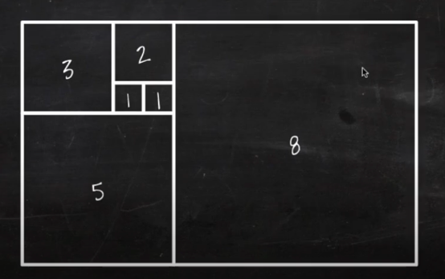
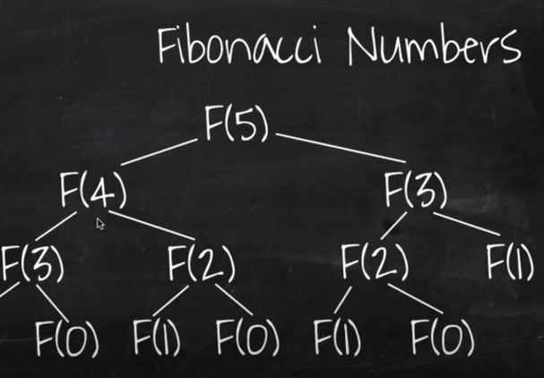

# Big-O란?
- 알고리즘의 효율을 수학적으로 설명하는 것
- 시간과 공간의 복잡도를 표현할 수 있음
- 알고리즘의 실제 러닝 타임이 아니라 데이터나 사용자의 증가율에 따른 알고리즘의 성능을 예측하는 것이 목표

## O(1) : constant time
`
F(int[] n) {
    return (n[0] == 0) ? true : false;
}
`
- 입력 데이터의 크기에 관계없이 언제나 일정한 시간이 걸리는 알고리즘
.png)

## O(n) : linear time
`
F(int[] n) {
    for i = 0 to n.length
        print i;
}
`
- 입력 데이터의 크기에 비례해서 처리시간이 걸리는 알고리즘
.png)

## O(n²) : quadratic time
`
F(int[] n) {
    for i = 0 to n.length
        for j = 0 to n.length
            print i + j;
}
`

.png)

## O(nm) : quadratic time
`
F(int[] n, int[] m) {
    for i = 0 to n.length
        for j = 0 to m.length
            print i + j;
}
`
- n과 m의 크기가 다르기 때문에 O(n²)이라고 착각하기 쉽지만, 다른 것임
.png)

## O(n³) : polynomial / cubic time
`
F(int[] n) {
    for i = 0 to n.length
        for j = 0 to n.length
            for k = 0 to n.length
                print i + j + k;
}
`
.png)

## O(2ⁿ) : exponential time
- 피보나치 수열

`
F(n, r) {
if(n <= 0) return 0;
else if(n == 1) return r[n] = 1;
return r[n] = F(n - 1, r) + F(n - 2, r);
}
`
.png)

## O(mⁿ) : exponential time

## O(log n) : binary search

`
F(k, arr, s, e) {
    if(s > e) return -1;
    m = (s + e) / 2;
    if(arr[m] == k) return m;
    else if(arr[m] > k) return F(k, arr, s, m - 1);
    else return F(k, arr, m + 1, e);
}
`
.png)

## O(Sqrt(n))
.png)