# Fibonacci란?
- 피보나치수열은 1부터 시작해서 한 면을 기준으로 정사각형을 만드는 과정
- 늘어난 면을 기준으로 정사각형을 붙여준다.

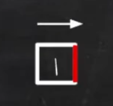
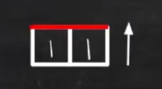
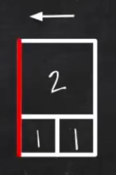
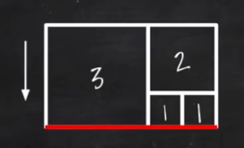
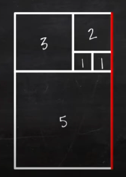
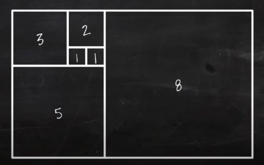
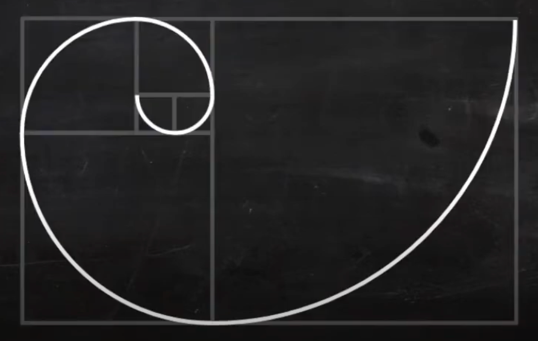
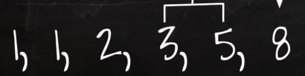

- sudo code
`
F(n, r) {
    if(n <= 0) return 0;
    else if(n == 1) return r[n] = 1;
    return r[n] = F(n - 1, r) + F(n - 2, r);
}
`

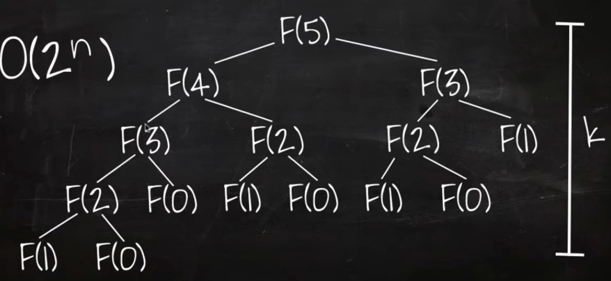

## 최적화
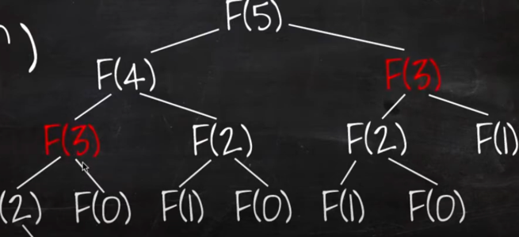
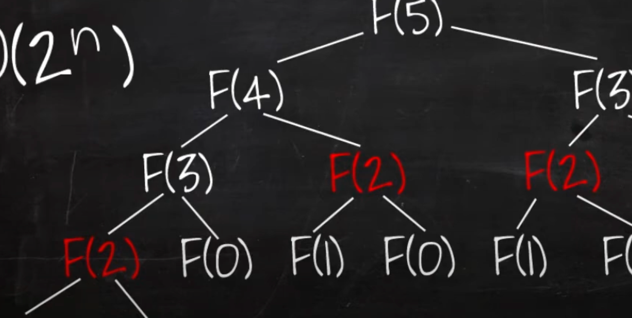
- 위의 로직은 불필요한 작업들이 존재함
`
F(n, r) {
    if(n <= 0) return 0;
    else if(n == 1) return r[n] = 1;
    else if(r[n] > 0) return r[n]; // 기존의 결과를 재사용하는 코드 추가
    return r[n] = F(n - 1, r) + F(n - 2, r);
}
`
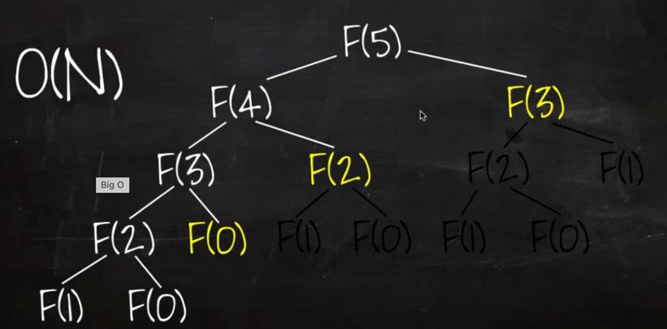
- 불필요한 작업을 없애면 O(2ⁿ) -> O(n)

## 시간 복잡도 계산
`
allF(n) {
    for(i = 1 to n) print F(i)
}
F(n) {
    if(n <= 0) return 0
    else if(n == 1) return 1
    return F(n - 1) + F(n - 2)
}
`
- F(n)은 n번째 피보나치 수열을 가져오는 함수
- allF(n)은 1부터 n까지 돌면서 피보나치수열의 i번째 수를 출력하는 함수
- 위 코드의 시간 복잡도는?

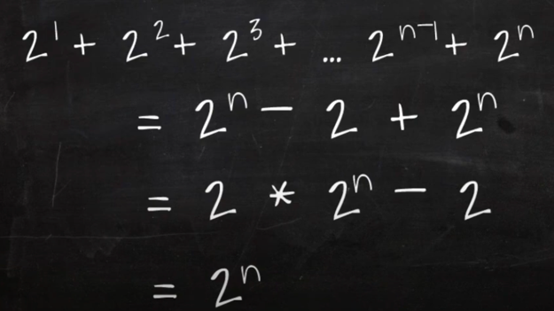
- 대부분은 O(n2ⁿ)라고 생각하겠지만, 실제로는 O(2ⁿ)이다.